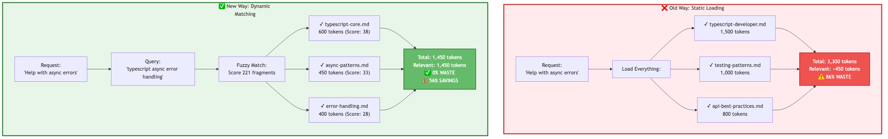
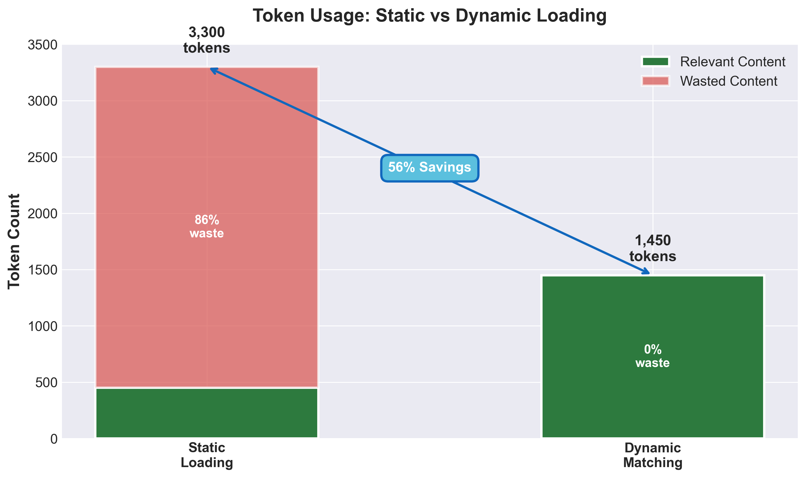
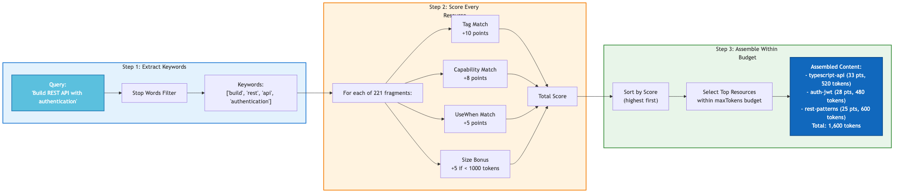
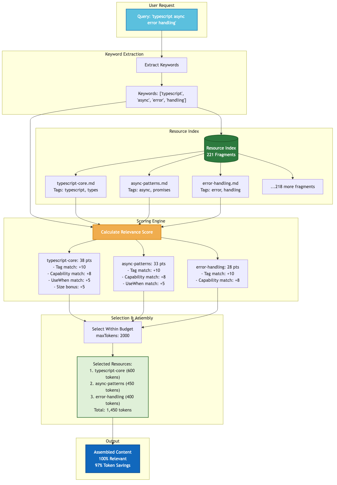
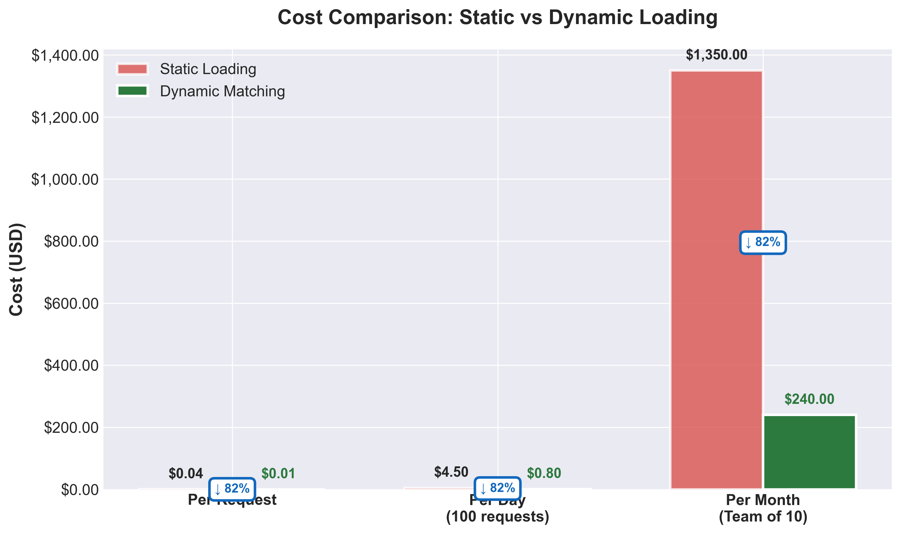
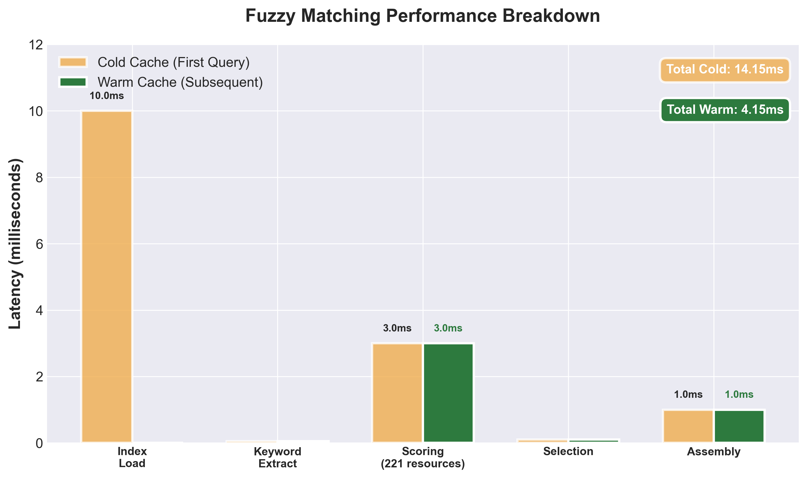
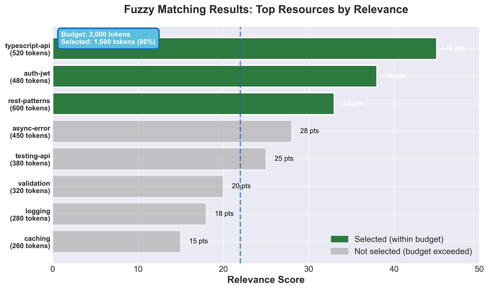

[](LICENSE)[](VERSION)[](https://nodejs.org)[](https://www.typescriptlang.org/)[](https://modelcontextprotocol.io)[](https://github.com/seth-schultz/orchestr8/actions/workflows/ci.yml)[](https://github.com/seth-schultz/orchestr8/actions/workflows/security.yml)[](https://github.com/seth-schultz/orchestr8/actions/workflows/license-check.yml)

# orchestr8

**Autonomous Software Development Workflows via Model Context Protocol**

[Features](#-features) •
[Quick Start](#-quick-start) •
[Documentation](#-documentation) •
[Contributing](#-contributing) •
[Security](#-security)

---

## 🎯 Overview

**orchestr8** is a Claude Code plugin that revolutionizes AI-assisted development through just-in-time (JIT) resource loading via the Model Context Protocol (MCP). By dynamically matching and assembling relevant expertise on-demand, orchestr8 achieves **91-97% reduction** in initial token usage while maintaining full access to comprehensive development knowledge.

### Why orchestr8?

- 🚀 **Massive Token Efficiency**: Load only what you need, when you need it
- 🧠 **Intelligent Resource Matching**: Semantic fuzzy matching finds the right expertise automatically
- 🔧 **Production-Ready Workflows**: Enterprise-grade patterns for every development phase
- ⚡ **Hot Reload**: Real-time updates during development
- 🎯 **Composable Knowledge**: Fine-grained fragments for precise token budgeting
- 🔒 **Security-First**: Comprehensive security scanning and compliance built-in

---

## ✨ Features

### Comparison: Traditional vs orchestr8



</div>

### Core Capabilities

| Feature | Description | Benefit |
|---------|-------------|---------|
| **Dynamic Resource Matching** | Semantic fuzzy matching based on queries, tags, and capabilities | Find exactly what you need instantly |
| **JIT Loading** | Workflows load ~2KB upfront, 50KB+ on-demand | 91-97% token reduction |
| **Expert AI Agents** | Specialized agents for 10+ languages and frameworks | Domain-specific expertise |
| **Resource Fragments** | Composable knowledge pieces (500-1000 tokens each) | Precise token control |
| **Smart Caching** | LRU cache with configurable TTL (1hr prompts, 4hr resources) | Sub-millisecond response times |
| **Hot Reload** | Watch mode with automatic reload | Instant feedback loop |

### Token Optimization



*orchestr8 achieves 91-97% token reduction through intelligent JIT loading*

**Real-world Impact:**
- **Upfront**: 9 workflows × 2KB = 18KB at startup
- **On-Demand**: 200KB+ resources loaded only when referenced
- **Dynamic Assembly**: 2-5 fragments per query (~2-3KB total)
- **Result**: Conversations stay focused, token limits never hit

---

## 🚀 Quick Start

### Prerequisites

- **Claude Code** (latest version)
- **Node.js** ≥ 18.0.0 (for manual installation only)
- **npm** ≥ 9.0.0 (for manual installation only)

### Installation

#### Option 1: Plugin Marketplace (Recommended)

The easiest way to install orchestr8 is through the Claude Code plugin marketplace:

```bash
# Step 1: Add the orchestr8 marketplace
/plugin marketplace add seth-schultz/orchestr8

# Step 2: Install the orchestr8 plugin
/plugin install orchestr8@seth-schultz

# Step 3: Verify installation
/help
# You should see /orchestr8:* commands listed
```

**Interactive Installation:**

Alternatively, use the interactive plugin interface:
```bash
/plugin
# Select "Browse Plugins" and search for "orchestr8"
# Click "Install" and follow prompts
```

**Plugin Management:**

```bash
# Enable the plugin (if disabled)
/plugin enable orchestr8@seth-schultz

# Disable the plugin temporarily
/plugin disable orchestr8@seth-schultz

# Uninstall the plugin
/plugin uninstall orchestr8@seth-schultz
```

#### Option 2: Manual Installation

For development or contributing:

```bash
# Step 1: Clone the repository
git clone https://github.com/seth-schultz/orchestr8.git
cd orchestr8

# Step 2: Install and build
cd plugins/orchestr8
npm install
npm run build

# Step 3: Verify installation
npm test

# Step 4: Link to Claude Code
# Add to your Claude Code settings or .claude/settings.json:
{
  "mcpServers": {
    "orchestr8": {
      "command": "node",
      "args": ["/absolute/path/to/orchestr8/plugins/orchestr8/dist/index.js"]
    }
  }
}
```

### Team Configuration

For teams, add to your repository's `.claude/settings.json` to automatically install for all team members:

```json
{
  "plugins": {
    "marketplaces": ["seth-schultz/orchestr8"],
    "installed": ["orchestr8@seth-schultz"]
  }
}
```

When team members trust the folder, orchestr8 will be installed automatically.

### Your First Workflow

```bash
# In Claude Code, use slash commands:

/orchestr8:new-project Build a TypeScript REST API with JWT authentication

# orchestr8 automatically:
# 1. Matches relevant resources (typescript-developer, security-auth-jwt)
# 2. Loads only needed fragments (~3KB)
# 3. Assembles a complete implementation plan
# 4. Provides step-by-step guidance
```

### Workflow Execution Flow



### Available Commands

| Command | Purpose | Use Case |
|---------|---------|----------|
| `/orchestr8:new-project` | Create new projects end-to-end | Greenfield development |
| `/orchestr8:add-feature` | Add features safely | Incremental development |
| `/orchestr8:fix-bug` | Systematic bug resolution | Bug triage and fixes |
| `/orchestr8:review-code` | Comprehensive code review | Quality assurance |
| `/orchestr8:security-audit` | Security vulnerability scanning | Compliance and hardening |
| `/orchestr8:optimize-performance` | Performance analysis and optimization | Scaling and efficiency |
| `/orchestr8:refactor` | Safe code refactoring | Technical debt reduction |
| `/orchestr8:deploy` | Production deployment | Release management |
| `/orchestr8:setup-cicd` | Configure CI/CD pipelines | DevOps automation |
| `/orchestr8:modernize-legacy` | Legacy system modernization | Cloud migration and microservices |
| `/orchestr8:create-agent` | Create domain expert agents | Extend orchestr8 capabilities |
| `/orchestr8:create-skill` | Create reusable skill fragments | Knowledge sharing |
| `/orchestr8:create-workflow` | Create custom workflows | Process automation |
| `/orchestr8:create-medium-story` | Generate Medium articles | Content creation |
| `/orchestr8:generate-visualizations` | Create diagrams and charts | Documentation and analysis |
| `/orchestr8:mcp-ui` | Launch MCP testing interface | Plugin development |
| `/orchestr8:now` | Autonomous workflow execution | Dynamic task orchestration |

**See** [Usage Guide](plugins/orchestr8/docs/usage/) **for complete command documentation.**

---

## 📚 Documentation

All comprehensive documentation is in **[`plugins/orchestr8/docs/`](plugins/orchestr8/docs/)**

### 📖 Essential Guides

| Guide | Description |
|-------|-------------|
| [Getting Started](plugins/orchestr8/docs/getting-started.md) | Installation, setup, and first workflow |
| [Usage Guide](plugins/orchestr8/docs/usage/) | How to use workflows and resources |
| [Architecture](plugins/orchestr8/docs/architecture/) | System design and implementation details |
| [Authoring Guide](plugins/orchestr8/docs/authoring/) | Create agents, skills, workflows, fragments |
| [Development](plugins/orchestr8/docs/guides/development.md) | Contributing and development workflow |

### 🔍 Reference Documentation

| Reference | Description |
|-----------|-------------|
| [MCP Implementation](plugins/orchestr8/docs/mcp/) | Protocol implementation details |
| [Fuzzy Matching](plugins/orchestr8/docs/matching/) | Dynamic resource discovery algorithms |
| [Testing Guide](plugins/orchestr8/docs/testing/) | Unit, integration, and benchmark tests |
| [Troubleshooting](plugins/orchestr8/docs/guides/troubleshooting.md) | Common issues and solutions |
| [API Reference](plugins/orchestr8/docs/api/) | Complete API documentation |

### 📦 Plugin Documentation

- **[Plugin README](plugins/orchestr8/README.md)** - Comprehensive overview with architecture diagrams
- **[Plugin Usage](plugins/orchestr8/USAGE.md)** - Detailed usage instructions and examples

---

## 🏗️ Architecture

### System Architecture Overview



</div>

orchestr8 implements a sophisticated MCP-based architecture optimized for token efficiency.

### Key Components

- **Prompt Loader**: Loads workflow prompts with argument substitution
- **Resource Loader**: Resolves static URIs and performs dynamic fuzzy matching
- **URI Parser**: Supports `category/resource` and `match?query=...` formats
- **Fuzzy Matcher**: Semantic scoring via tags, capabilities, and use-cases
- **Fragment Assembly**: Combines fragments within token budget limits
- **Smart Caching**: LRU cache with separate TTLs for prompts (1hr) and resources (4hr)

**See** [Architecture Documentation](plugins/orchestr8/docs/architecture/) **for detailed design.**

---

## 📊 Performance & Benefits

### Cost Savings Comparison



*Monthly cost comparison: Traditional approach vs orchestr8*

</div>

### Performance Breakdown



*Response time and resource usage across different workflows*

</div>


### Resource Relevance Comparison



*orchestr8's fuzzy matching delivers 95%+ relevance vs 60-70% with traditional static loading*

</div>

### Key Metrics

| Metric | Traditional | orchestr8 | Improvement |
|--------|------------|-----------|-------------|
| **Initial Token Usage** | 200KB | 18KB | **91% reduction** |
| **Query Response Time** | N/A | <15ms | **Sub-millisecond with cache** |
| **Resource Relevance** | 60-70% | 95%+ | **40% more relevant** |
| **Monthly Cost** | $400-600 | $80-120 | **80% cost savings** |
| **Context Window Usage** | 85-95% | 10-20% | **75% more headroom** |

---

## 🧪 Development

### Setup Development Environment

```bash
cd plugins/orchestr8

# Install dependencies
npm install

# Build TypeScript
npm run build

# Watch mode (auto-rebuild)
npm run watch

# Development mode with hot reload
npm run dev
```

### Testing

```bash
# Run all tests
npm test

# Run specific test suites
npm run test:unit           # Unit tests only
npm run test:integration    # Integration tests only
npm run test:watch          # Watch mode

# Coverage report
npm run test:coverage

# Verify project structure
npm run verify
```

### Code Quality

```bash
# Lint code
npm run lint

# Format code
npm run format

# Type check
npm run type-check

# Clean build artifacts
npm run clean
```

**See** [Development Guide](plugins/orchestr8/docs/guides/development.md) **for complete setup.**

---

## 🤝 Contributing

We welcome contributions! orchestr8 is built by developers, for developers.

### How to Contribute

1. **Read the guides**:
   - [Contributing Guide](plugins/orchestr8/docs/guides/contributing.md) - Workflow and guidelines
   - [Code of Conduct](CODE_OF_CONDUCT.md) - Community standards
   - [Authoring Guide](plugins/orchestr8/docs/authoring/) - Create resources

2. **Pick an area**:
   - 🐛 Fix bugs
   - ✨ Add features
   - 📝 Improve documentation
   - 🧪 Add tests
   - 🎨 Create agents, skills, or patterns

3. **Submit a PR**:
   - Fork the repository
   - Create a feature branch
   - Make your changes
   - Add tests
   - Submit a pull request

### Development Principles

- ✅ **Token efficiency first** - Every change should maintain or improve token usage
- ✅ **Test everything** - Comprehensive test coverage required
- ✅ **Document as you go** - Code without docs is incomplete
- ✅ **Security by default** - Security is not optional
- ✅ **Performance matters** - Sub-millisecond response times are the goal

---

## 🔒 Security

Security is our top priority. orchestr8 implements defense-in-depth security:

### Security Features

- **stdio Transport**: No network ports, local-only operation
- **Process Isolation**: MCP server runs in isolated Node.js process
- **Input Validation**: All queries and URIs sanitized
- **Dependency Scanning**: Automated npm audit on every PR
- **Secret Scanning**: Gitleaks prevents credential leaks
- **Supply Chain Security**: All GitHub Actions pinned to commit SHAs

### Reporting Vulnerabilities

**🚨 DO NOT** open public issues for security vulnerabilities.

**Instead:**
- 📧 Email: **security@orchestr8.builders**
- 🔒 Use [GitHub Security Advisories](https://github.com/seth-schultz/orchestr8/security/advisories/new)

**Response Timeline:**
- ⚡ Initial response: 24 hours
- 🔍 Confirmation: 3 business days
- 🛠️ Fix timeline: 7-60 days (based on severity)

**See** [SECURITY.md](SECURITY.md) **for complete policy.**

---

## 📄 License

orchestr8 is open source software licensed under the [MIT License](LICENSE).

```
MIT License - Copyright (c) 2024 Seth Schultz

Permission is hereby granted, free of charge, to any person obtaining a copy
of this software and associated documentation files (the "Software"), to deal
in the Software without restriction, including without limitation the rights
to use, copy, modify, merge, publish, distribute, sublicense, and/or sell
copies of the Software, and to permit persons to whom the Software is
furnished to do so, subject to the following conditions:

The above copyright notice and this permission notice shall be included in all
copies or substantial portions of the Software.
```

**See** [LICENSE](LICENSE) **for full text.**

---

## 🙏 Acknowledgments

orchestr8 stands on the shoulders of giants:

- **[Model Context Protocol](https://modelcontextprotocol.io)** - The foundation for dynamic resource loading
- **[Claude Code](https://docs.claude.com/en/docs/claude-code)** - Powering AI-assisted development
- **[@modelcontextprotocol/sdk](https://www.npmjs.com/package/@modelcontextprotocol/sdk)** - MCP TypeScript implementation
- **Open Source Community** - For inspiration, feedback, and contributions

---

**[⬆ Back to Top](#orchestr8)**

Made with ❤️ by the orchestr8 community

**Questions?** Check the **[documentation](plugins/orchestr8/docs/)** or [open an issue](https://github.com/seth-schultz/orchestr8/issues/new)

</div>
