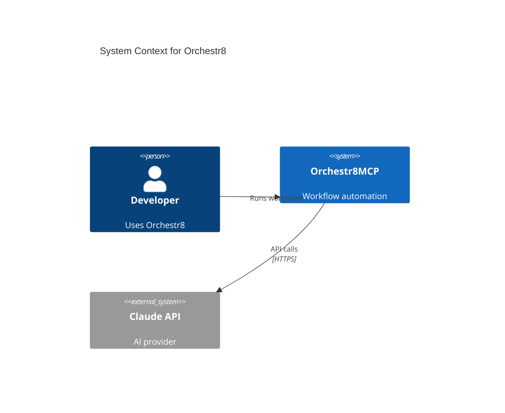

# Visualization Features for Medium Articles and Documentation

## Overview

Complete visualization generation system for creating professional diagrams, charts, hero images, and screenshots for Medium articles and technical documentation.

## What's New

### 1. Generate Visualizations Command

**Location**: `plugins/orchestr8/commands/generate-visualizations.md`

**Usage**:
```bash
# Generate all visualizations for a Medium article
/orchestr8:generate-visualizations medium/article.md

# Generate specific types
/orchestr8:generate-visualizations medium/article.md --type=diagrams
/orchestr8:generate-visualizations medium/article.md --type=charts
/orchestr8:generate-visualizations medium/article.md --type=hero

# Generate from theme
/orchestr8:generate-visualizations "AI optimization and token management"
```

**Features**:
- **6-Phase Workflow**: Analysis → Diagrams → Charts → Screenshots → Hero Images → Integration
- **Automatic Detection**: Identifies key concepts requiring visualization
- **Multiple Output Formats**: Mermaid diagrams, PNG charts, hero images
- **Organized Output**: Proper directory structure and documentation
- **Quality Validation**: Ensures all visualizations meet professional standards

### 2. Visualization Specialist Agent

**Location**: `plugins/orchestr8/prompts/agents/visualization-specialist.md`

**Capabilities**:
- Generate C4 model architecture diagrams (Levels 0-3)
- Create data flow and sequence diagrams
- Produce professional data charts
- Generate hero images with AI
- Capture technical screenshots
- Consistent styling and color schemes

**Standards**:
- Professional color palette
- Standardized file naming
- Quality checkpoints
- Accessibility (alt text, high contrast)

### 3. Skill Fragments

#### Mermaid Diagram Generation

**Location**: `plugins/orchestr8/resources/skills/_fragments/mermaid-diagram-generation.md`

**Diagram Types**:
- **C4 Architecture**: System Context, Container, Component, Code
- **Flow Diagrams**: Data flow, process flow, with swimlanes
- **Sequence Diagrams**: API interactions, async workflows
- **State Machines**: Workflow states and transitions
- **Entity Relationship**: Database schemas
- **Deployment Topology**: Infrastructure visualization

**Example Templates Included**:


#### Data Chart Generation

**Location**: `plugins/orchestr8/resources/skills/_fragments/data-chart-generation.md`

**Chart Types**:
- Comparison bar charts (before/after)
- Cost comparison charts
- Time series (performance over time)
- Distribution charts (pie charts)
- Multi-metric benchmarks

**Features**:
- Professional styling with matplotlib
- High-resolution output (150-300 DPI)
- Optimized file sizes
- Automatic reduction annotations
- Responsive sizing for different contexts

#### Hero Image Generation

**Location**: `plugins/orchestr8/resources/skills/_fragments/medium-hero-image-generation.md` (previously created)

**Methods**:
- AI generation (DALL-E 3, Stable Diffusion)
- Gradient fallbacks
- Curated stock photo guidance

**Specifications**:
- 1920x1080 resolution (16:9 aspect ratio)
- Professional, modern aesthetic
- Optimized file size (<5MB)
- Descriptive alt text

### 4. Generation Scripts

#### Hero Image Generator

**Location**: `plugins/orchestr8/scripts/generate-hero-image.py`

**Usage**:
```bash
# From markdown file
python scripts/generate-hero-image.py --file medium/article.md --method dalle --update

# Manual
python scripts/generate-hero-image.py --title "Article Title" --theme "AI optimization" --method replicate

# Interactive
python scripts/generate-hero-image.py --interactive
```

**Methods**:
- `dalle`: DALL-E 3 ($0.04-0.08 per image)
- `replicate`: Stable Diffusion ($0.002-0.005 per image)
- `gradient`: Free fallback (no API needed)

#### Chart Generator

**Location**: `plugins/orchestr8/scripts/generate-chart.py`

**Usage**:
```bash
# Comparison chart
python scripts/generate-chart.py --type comparison --data '{"Before": 200000, "After": 5000}' --title "Token Usage" --output medium/images/token-comparison.png

# Cost chart
python scripts/generate-chart.py --type cost --data '{"DALL-E": 0.06, "SD": 0.003}' --output medium/images/cost.png

# Pie chart
python scripts/generate-chart.py --type pie --data '{"Core": 35, "API": 25, "Data": 20}' --output medium/images/distribution.png

# Auto-extract from article
python scripts/generate-chart.py --file medium/article.md --auto --output-dir medium/images/
```

**Features**:
- Professional matplotlib styling
- Automatic metric extraction from articles
- Multiple chart types
- High-resolution output
- Optimized file sizes

## File Organization

```
plugins/orchestr8/
├── commands/
│   └── generate-visualizations.md           # Main command workflow
├── prompts/
│   └── agents/
│       └── visualization-specialist.md      # Specialist agent
├── resources/
│   ├── skills/_fragments/
│   │   ├── mermaid-diagram-generation.md   # Mermaid templates & guides
│   │   ├── data-chart-generation.md        # Chart generation patterns
│   │   └── medium-hero-image-generation.md # Hero image creation
│   └── examples/_fragments/
│       └── medium-hero-image-example.md    # Usage examples
└── scripts/
    ├── generate-hero-image.py              # Hero image script
    ├── generate-chart.py                   # Chart generation script
    └── README.md                           # Scripts documentation
```

## Output Structure

```
medium/
├── article.md                              # Your article
├── images/                                 # All raster images
│   ├── hero.png                           # AI-generated hero image
│   ├── token-comparison.png               # Data charts
│   ├── cost-comparison.png
│   └── screenshot-code.png
└── diagrams/                              # All Mermaid diagrams
    ├── architecture-system-context.md     # C4 Level 0
    ├── architecture-containers.md         # C4 Level 1
    ├── dataflow-resource-loading.md       # Data flow
    ├── sequence-api-auth.md               # API sequence
    └── README.md                          # Index of diagrams
```

## Integration with Medium Workflow

The Medium story creation workflow (`workflow-create-medium-story.md`) now includes visualization generation in Phase 4:

```markdown
## Phase 4: Finalization & Export (90-100%)

### 4. Generate Hero Image (Optional)

**→ Load:** orchestr8://skills/medium-hero-image-generation

**Activities:**
- Extract article theme and primary topic
- Generate AI-powered hero image
- Create charts for key metrics
- Generate architecture diagrams
- Update article with image references
```

## Quick Start Examples

### Generate All Visualizations for Medium Article

```bash
# 1. Create Medium article
/orchestr8:create-medium-story "Your compelling topic"

# 2. Generate all visualizations
/orchestr8:generate-visualizations medium/2025-11-11-article-slug.md

# Result: Hero image, charts, diagrams all generated and integrated
```

### Manual Hero Image Generation

```bash
# Using DALL-E 3 (best quality)
python scripts/generate-hero-image.py \
  --title "I Cut My AI Assistant's Memory by 95%" \
  --theme "AI optimization, just-in-time loading" \
  --method dalle \
  --output medium/images/

# Using Stable Diffusion (cost-effective)
python scripts/generate-hero-image.py \
  --file medium/article.md \
  --method replicate \
  --update

# Gradient fallback (free, no API)
python scripts/generate-hero-image.py \
  --file medium/article.md \
  --method gradient \
  --update
```

### Generate Data Charts

```bash
# Token usage comparison
python scripts/generate-chart.py \
  --type comparison \
  --data '{"Traditional": 200000, "On-Demand": 5000}' \
  --title "Token Usage: 97% Reduction" \
  --output medium/images/token-comparison.png

# Cost savings
python scripts/generate-chart.py \
  --type cost \
  --data '{"Before": 0.60, "After": 0.015}' \
  --title "Cost per Request" \
  --output medium/images/cost-savings.png

# Auto-extract metrics from article
python scripts/generate-chart.py \
  --file medium/article.md \
  --auto \
  --output-dir medium/images/
```

### Create Mermaid Diagrams

```markdown
# In your article or documentation, use Mermaid syntax:


```

## Setup Requirements

### Python Dependencies

```bash
# For hero image generation
pip install openai replicate Pillow requests pyyaml

# For chart generation
pip install matplotlib numpy

# All dependencies
pip install openai replicate Pillow requests pyyaml matplotlib numpy
```

### Environment Variables

```bash
# For AI image generation
export OPENAI_API_KEY="your-openai-api-key"          # DALL-E 3
export REPLICATE_API_TOKEN="your-replicate-token"    # Stable Diffusion

# Optional: Chart styling
export CHART_THEME="professional"  # professional, minimal, vibrant
export CHART_DPI="150"             # 150 for web, 300 for print
```

## Quality Standards

All generated visualizations meet these standards:

### Mermaid Diagrams
- ✅ Render correctly in GitHub, VS Code, Mermaid Live
- ✅ Consistent color scheme (blue for internal, gray for external, etc.)
- ✅ Clear labels without abbreviations
- ✅ Appropriate complexity level
- ✅ Include title, description, and key points

### Charts
- ✅ High resolution (150+ DPI)
- ✅ Professional color palette
- ✅ Clear legends and labels
- ✅ Readable at thumbnail size
- ✅ Optimized file size (<500KB)
- ✅ Source attribution if needed

### Hero Images
- ✅ 1920x1080 resolution (16:9)
- ✅ Professional, modern aesthetic
- ✅ Matches article theme
- ✅ No text or watermarks
- ✅ File size <5MB
- ✅ Descriptive alt text

## Cost Analysis

| Service | Cost per Image | Quality | Best For |
|---------|---------------|---------|----------|
| DALL-E 3 | $0.04-0.08 | Excellent | Final hero images, high-quality visuals |
| Stable Diffusion (Replicate) | $0.002-0.005 | Very Good | Draft images, cost-sensitive projects |
| Gradient Fallback | Free | Basic | Fallback, simple backgrounds |
| Matplotlib Charts | Free | Professional | All data visualizations |
| Mermaid Diagrams | Free | Professional | All technical diagrams |

## Best Practices

1. **Start with Diagrams**: Create Mermaid diagrams first for technical concepts
2. **Extract Metrics**: Let scripts auto-extract data from articles for charts
3. **Generate Hero Last**: Create hero image after content is finalized
4. **Test Rendering**: Preview all visualizations in target platform
5. **Optimize Files**: Run through optimization tools before publishing
6. **Consistent Style**: Maintain visual consistency across all assets
7. **Alt Text Always**: Include descriptive alt text for accessibility
8. **Version Control**: Keep Mermaid diagrams in markdown for easy versioning

## Troubleshooting

### Mermaid Diagrams Not Rendering
- Validate syntax at https://mermaid.live
- Check for special characters (escape if needed)
- Verify proper indentation
- Test in target platform (GitHub, VS Code)

### Charts Look Unprofessional
- Increase DPI (300 for print quality)
- Use professional color palette
- Add proper labels and legend
- Ensure sufficient white space

### Hero Image Quality Issues
- Try DALL-E 3 for best quality
- Refine theme description with specific keywords
- Use gradient fallback if APIs unavailable
- Manually select from Unsplash as alternative

### API Errors
- Verify environment variables are set
- Check API key validity
- Ensure sufficient API credits
- Use fallback methods if needed

## Future Enhancements

Planned features:
- [ ] Mermaid diagram CLI renderer (convert .md to .png)
- [ ] Interactive Chart.js support
- [ ] Custom style presets for charts
- [ ] Batch generation for multiple articles
- [ ] A/B testing for hero images
- [ ] Video thumbnail generation
- [ ] GIF creation for animated diagrams

## Resources

- **Mermaid Live Editor**: https://mermaid.live
- **Matplotlib Gallery**: https://matplotlib.org/stable/gallery/
- **Unsplash**: https://unsplash.com (free stock photos)
- **OpenAI API**: https://platform.openai.com
- **Replicate**: https://replicate.com

---

**With these tools, you can create world-class visualizations for any technical content!**
