# Updated v8.0 Diagrams and Charts

This file contains Mermaid diagrams with updated v8.0 statistics. Use a Mermaid renderer or mermaid-cli to convert to PNG/SVG.

## 1. Cost Savings Comparison Chart

```mermaid
%%{init: {'theme':'base', 'themeVariables': { 'primaryColor':'#1168bd','primaryTextColor':'#fff','primaryBorderColor':'#0b4884','lineColor':'#666','secondaryColor':'#5cb85c','tertiaryColor':'#d9534f'}}}%%
graph TB
    subgraph "Monthly Cost Comparison"
        Traditional["Traditional Approach<br/>$400-600/month<br/><br/>❌ Load all resources upfront<br/>❌ 200KB+ per session<br/>❌ 85-95% context usage"]

        Orchestr8["orchestr8 v8.0<br/>$60-100/month<br/><br/>✅ JIT loading (77-83% savings)<br/>✅ Progressive loading (52-82% savings)<br/>✅ 10-20% context usage"]

        Savings["💰 85% Cost Savings<br/><br/>$300-500/month saved<br/>$3,600-6,000/year saved"]
    end

    Traditional -->|vs| Orchestr8
    Orchestr8 -->|Result| Savings

    style Traditional fill:#d9534f,stroke:#a94442,color:#fff
    style Orchestr8 fill:#5cb85c,stroke:#4cae4c,color:#fff
    style Savings fill:#f0ad4e,stroke:#eea236,color:#333
```



## 2. Token Comparison Chart (with Progressive Loading)


## 3. Performance Breakdown Chart


## 4. Relevance Comparison Chart

```mermaid
%%{init: {'theme':'base'}}%%
graph LR
    subgraph "Resource Relevance Accuracy"
        Traditional["Traditional Static Loading<br/><br/>60-70% Relevance<br/>❌ All resources loaded<br/>❌ Many irrelevant<br/>❌ Manual filtering needed"]

        Orchestr8["orchestr8 v8.0 Fuzzy Matching<br/><br/>95%+ Relevance<br/>✅ 1,675 useWhen scenarios<br/>✅ 4,036 indexed keywords<br/>✅ Automatic scoring"]
    end

    Traditional -->|40% more relevant| Orchestr8

    style Traditional fill:#d9534f,stroke:#a94442,color:#fff
    style Orchestr8 fill:#5cb85c,stroke:#4cae4c,color:#fff
```



## 5. Architecture Diagram - v8.0


## 6. Traditional vs orchestr8 Comparison

```mermaid
graph TB
    subgraph "Traditional Approach"
        T_Load["Load ALL Resources<br/>200KB upfront<br/>~50,000 tokens"]
        T_Filter["Manual Filtering<br/>Find what you need<br/>Waste 85-95% context"]
        T_Use["Use 5-10%<br/>Most loaded content<br/>never used"]

        T_Load --> T_Filter
        T_Filter --> T_Use
    end

    subgraph "orchestr8 v8.0 Approach"
        O_Query["Query Registry<br/>250 tokens<br/>Lightweight catalog"]
        O_Match["Fuzzy Match<br/>1,675 scenarios<br/>4,036 keywords<br/>95%+ relevance"]
        O_Load["Load JIT<br/>Only matched resources<br/>~1,500-2,000 tokens"]
        O_Progressive["Progressive Loading<br/>Core first (600 tokens)<br/>Advanced when needed (400 tokens)"]

        O_Query --> O_Match
        O_Match --> O_Load
        O_Load --> O_Progressive
    end

    Comparison["⚡ 95% Token Reduction<br/>💰 85% Cost Savings<br/>🎯 40% More Relevant<br/>⏱️ <15ms Discovery"]

    T_Use -.->|vs| O_Progressive
    O_Progressive --> Comparison

    style T_Load fill:#d9534f,stroke:#a94442,color:#fff
    style O_Query fill:#5cb85c,stroke:#4cae4c,color:#fff
    style O_Match fill:#5cb85c,stroke:#4cae4c,color:#fff
    style O_Load fill:#5cb85c,stroke:#4cae4c,color:#fff
    style O_Progressive fill:#5cb85c,stroke:#4cae4c,color:#fff
    style Comparison fill:#f0ad4e,stroke:#eea236,color:#333
```



## 7. Workflow Execution Flow - v8.0


## 8. v8.0 Optimization Impact


---

## Rendering Instructions

To convert these Mermaid diagrams to PNG/SVG for the README:

### Option 1: Using mermaid-cli (Recommended)

```bash
# Install mermaid-cli
npm install -g @mermaid-js/mermaid-cli

# Convert to PNG (high resolution)
mmdc -i diagrams-v8-updated.md -o cost-savings-chart.png -w 1200 -H 800 -b transparent

# Or use the script
npm run generate:diagrams
```

### Option 2: Using Online Tools

1. Copy each Mermaid block
2. Paste into https://mermaid.live/
3. Export as PNG/SVG
4. Save to `plugins/orchestr8/docs/images/`

### Option 3: Using Mermaid in Documentation

Many markdown renderers support Mermaid natively (GitHub, GitLab, etc.)

---

## Files to Update

Replace the following files with rendered versions:

1. `cost-savings-chart.png` - Diagram #1
2. `token-comparison-chart.png` - Diagram #2
3. `performance-breakdown-chart.png` - Diagrams #3 (both charts)
4. `relevance-comparison-chart.png` - Diagram #4
5. `diagram-architecture-1.png` - Diagram #5
6. `diagram-comparison-1.png` - Diagram #6
7. `diagram-flow-1.png` - Diagram #7
