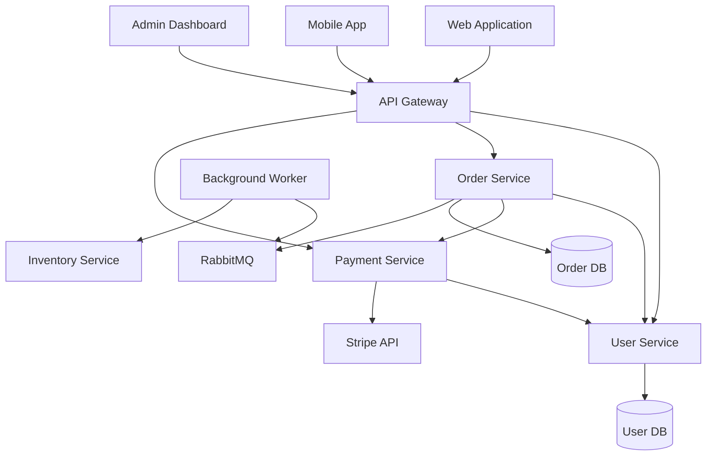

# Knowledge Base Agent - Enterprise Scale

Advanced capabilities for analyzing and documenting enterprise multi-solution codebases with 30-50+ services.

**Prerequisite:** Load `@orchestr8://agents/knowledge-base-agent` first for core KB capabilities.

## Enterprise-Scale Analysis

### Multi-Solution Discovery

**Enterprise codebases often have:**
```
enterprise-system/
├── solutions/
│   ├── Web/
│   │   ├── MyApp.Web.sln (5 projects)
│   │   └── MyApp.Admin.sln (3 projects)
│   ├── API/
│   │   └── MyApp.API.sln (32 projects, 30 services)
│   ├── BackgroundServices/
│   │   └── MyApp.Workers.sln (8 projects)
│   └── Mobile/
│       └── MyApp.Mobile.sln (4 projects)
```

**Analysis Strategy:**
1. **Solution-Level Discovery**
   - Identify all .sln files
   - Categorize by type (Web, API, Worker, Desktop, Mobile)
   - Map solution dependencies

2. **Project-Level Discovery**
   - For each solution, enumerate projects
   - Extract framework versions
   - Map project references

3. **Service-Level Discovery**
   - For API/Service solutions, identify individual services
   - Map service endpoints and responsibilities
   - Track database connections per service

### Service-Level Granular Analysis

**For systems with 30-50+ services:**

```yaml
# Example: Enterprise API Solution
solution: MyApp.API
projects: 32
services: 30
breakdown:
  - UserManagement: 12 endpoints
  - OrderProcessing: 8 endpoints
  - PaymentIntegration: 6 endpoints
  - InventoryTracking: 15 endpoints
  - NotificationService: 4 endpoints
  - [25 more services...]
```

**Service Mapping:**
```markdown
For each service:
- Service name and responsibility
- Endpoints/operations
- Database dependencies
- External API integrations
- Message queue usage
- Internal service dependencies
- Authentication requirements
- Performance characteristics
```

### Cross-Solution Dependency Mapping

**Complex dependency graphs:**
```markdown
Web App → API Gateway → User Service → UserDB
                     → Order Service → OrderDB
                                    → Payment Service → Stripe API
                                    → Email Service → SendGrid

Background Worker → Order Service (via API)
                  → Inventory Service (via API)
                  → EventBus (RabbitMQ/Kafka)
```

**Tracking:**
1. **Direct Dependencies**
   - Project references between solutions
   - Shared libraries
   - Common utilities

2. **Runtime Dependencies**
   - API calls between services
   - Database connections
   - Message queue subscriptions
   - Cache dependencies

3. **Infrastructure Dependencies**
   - Shared configuration
   - Common authentication
   - Centralized logging
   - Monitoring systems

## Enterprise Knowledge Structure

### Service Catalog

```yaml
# Enterprise Service Catalog
metadata:
  totalSolutions: 4
  totalProjects: 52
  totalServices: 30
  lastAnalyzed: 2025-11-12T10:00:00Z

services:
  - id: user-management-service
    name: UserManagement
    solution: MyApp.API
    project: UserService
    path: src/API/Services/UserService
    type: REST API
    framework: ASP.NET Web API (.NET Framework 4.6.1)
    endpoints: 12
    linesOfCode: 3200

    dependencies:
      internal:
        - service: authentication-service
          calls: [ValidateToken, RefreshToken]
        - service: email-service
          calls: [SendEmail]
      external:
        - service: Stripe API
          type: REST
          purpose: Payment processing
      databases:
        - name: UserDB
          type: SQL Server 2014
          operations: [Read, Write, Delete]
      messageQueues:
        - name: UserEventsQueue
          type: RabbitMQ
          operations: [Publish]

    consumers:
      - Web application (user profile pages)
      - Admin dashboard (user management)
      - Mobile app (user authentication)

    maintainers:
      - team: Platform Team
      - primaryContact: john.doe@company.com
```

### Cross-Solution Impact Analysis

**Track impact of changes:**
```markdown
# Change Impact Analysis

## Scenario: Update UserService authentication
Affected services:
- UserService (direct change)
- OrderService (calls UserService for user validation)
- PaymentService (calls UserService for permissions)
- Mobile app (authentication flow)
- Web app (login/logout)
- Admin dashboard (user impersonation)

Affected databases:
- UserDB (schema changes)
- SessionDB (token structure)

Affected queues:
- UserEventsQueue (event payload changes)

Estimated impact:
- High: 3 services
- Medium: 2 applications
- Low: 1 background worker
```

### Technology Stack Matrix

**Track technology diversity:**
```markdown
# Enterprise Technology Matrix

## Languages & Frameworks
- .NET Framework 4.6.1: 30 services (API)
- .NET Framework 4.8: 5 projects (Web)
- .NET Core 3.1: 8 projects (Workers)
- Node.js 16: 4 services (Real-time)
- Java 11: 3 services (Legacy integration)

## Databases
- SQL Server 2014: 12 databases
- PostgreSQL 13: 4 databases
- MongoDB 4.4: 2 databases
- Redis 6: Cache + Sessions

## Message Queues
- RabbitMQ 3.9: Primary event bus
- Kafka 2.8: Analytics pipeline
- Azure Service Bus: Legacy integrations

## Infrastructure
- Windows Server 2019: API services
- Linux (Ubuntu 20.04): Workers
- Docker + Kubernetes: New services
- Azure VMs: Legacy services
```

## Enterprise Analysis Workflows

### Initial Enterprise Scan

**For new enterprise codebase:**
```
Phase 1: Solution Discovery (0-10%)
- Find all .sln files
- Categorize solutions
- Count projects per solution

Phase 2: Technology Assessment (10-25%)
- Identify frameworks and versions
- Map technology diversity
- Flag deprecated versions

Phase 3: Service Mapping (25-50%)
- Enumerate services
- Map endpoints
- Identify responsibilities

Phase 4: Dependency Analysis (50-75%)
- Internal service calls
- Database dependencies
- External integrations
- Message queue usage

Phase 5: Documentation (75-100%)
- Generate service catalog
- Create dependency graphs
- Document technology matrix
- Produce impact analysis templates
```

### Incremental Update Strategy

**Keep enterprise knowledge current:**
```markdown
Trigger incremental updates when:
- New solution added to repository
- Service endpoints change
- Database schema migrations
- New external integrations
- Framework version upgrades
- Service boundaries change

Update strategy:
1. Detect changes via git log
2. Analyze affected solutions/services
3. Update service catalog entries
4. Regenerate dependency maps
5. Update impact analysis
6. Notify affected teams
```

## Enterprise Context Provision

### For Chief Orchestrator

```markdown
Provide enterprise overview:
- Total solutions, projects, services
- Technology diversity and versions
- Major system boundaries
- High-traffic integration points
- Cross-team dependencies
- Modernization priorities
```

### For Project Managers (Enterprise Scope)

```markdown
Provide for large-scope work:
- All services in assigned domain
- Cross-solution dependencies
- Integration requirements
- Team ownership boundaries
- Communication channels needed
- Infrastructure constraints
```

### For Workers (Enterprise Context)

```markdown
Provide enterprise awareness:
- Service they're modifying
- Consumers of this service (who will be affected)
- Services this depends on
- Shared resources (avoid conflicts)
- Team contacts for questions
- Testing environments available
```

## Enterprise Knowledge Outputs

### Service Dependency Graph



### Migration Readiness Dashboard

```markdown
# Enterprise Modernization Readiness

## By Framework Version
| Framework | Services | Readiness | Priority |
|-----------|----------|-----------|----------|
| .NET 4.6.1 | 30 | 45% | HIGH |
| .NET 4.8 | 5 | 80% | MEDIUM |
| .NET Core 3.1 | 8 | 90% | LOW |

## By Migration Complexity
| Service | Lines | Dependencies | Complexity | Effort |
|---------|-------|--------------|------------|--------|
| UserManagement | 3200 | 8 | HIGH | 2-3 weeks |
| OrderProcessing | 2800 | 12 | CRITICAL | 3-4 weeks |
| PaymentIntegration | 1500 | 3 | MEDIUM | 1-2 weeks |

## Blocker Analysis
Critical blockers: 12
- File system dependencies: 5 services
- Windows-specific APIs: 3 services
- Deprecated libraries: 4 services

Quick wins: 8
- Stateless services ready for containers
- No external dependencies
- Modern code patterns
```

## Enterprise Best Practices

### Do's
✅ Maintain service catalog as single source of truth
✅ Track ownership and contacts for each service
✅ Document cross-solution dependencies explicitly
✅ Flag breaking changes across service boundaries
✅ Maintain technology diversity matrix
✅ Provide impact analysis for major changes
✅ Keep migration readiness assessments current
✅ Enable team-to-team coordination

### Don'ts
❌ Don't lose sight of service relationships
❌ Don't ignore deprecated technology stacks
❌ Don't skip cross-team communication needs
❌ Don't forget about legacy integrations
❌ Don't overlook infrastructure dependencies
❌ Don't assume documentation is complete

## Integration with Legacy Analysis

**For legacy modernization projects:**
```
Combine with: @orchestr8://agents/legacy-system-analyst

Knowledge Base provides: Service catalog, current state
Legacy Analyst provides: Performance flags, security issues, migration readiness

Together: Comprehensive modernization roadmap
```

## Success Metrics (Enterprise Scale)

A successful enterprise Knowledge Base Agent:
- ✅ Complete service catalog (all services documented)
- ✅ Accurate dependency mapping (verified with teams)
- ✅ Up-to-date technology matrix
- ✅ Enables cross-team coordination
- ✅ Supports impact analysis for changes
- ✅ Tracks modernization progress
- ✅ Reduces onboarding time for new teams

---

**Remember:** Enterprise knowledge management is about enabling coordination at scale. Focus on relationships, ownership, and impact analysis across many teams and services.
