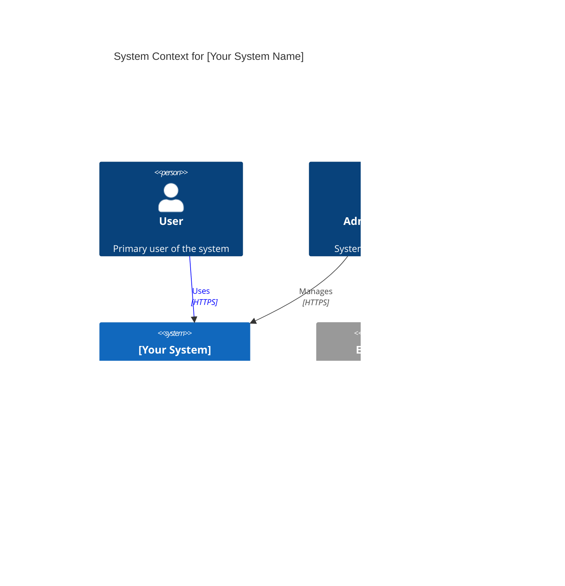

# Mermaid Diagram Generation

Master the art of creating professional, clear Mermaid diagrams for technical documentation, architecture visualization, and Medium articles.

## Overview

Mermaid is a JavaScript-based diagramming tool that uses markdown-like syntax to generate diagrams. It renders natively in:
- GitHub markdown
- GitLab
- VS Code (with extensions)
- Medium (with code blocks)
- Confluence
- Notion

**Benefits:**
- Version control friendly (text-based)
- Easy to maintain and update
- No external tools required
- Renders consistently across platforms
- Fast to create and iterate

## C4 Model Architecture Diagrams

The C4 model provides a hierarchical approach to documenting software architecture.

### Level 0: System Context

**Purpose**: Show the system and its relationships with users and external systems

**Template:**


**When to use:**
- Initial architecture documentation
- Explaining system boundaries
- Stakeholder communication
- Medium article: "How [System] fits in the ecosystem"

### Level 1: Container Diagram

**Purpose**: Show major technology containers (applications, databases, file systems)

**Template:**


**When to use:**
- Showing technical architecture
- Deployment planning
- Technology stack explanation
- Medium article: "How we built [System]"

### Level 2: Component Diagram

**Purpose**: Show components within a container and their relationships

**Template:**


**When to use:**
- Detailed technical documentation
- Code review preparation
- Onboarding new developers
- Medium article: "Inside the [Component] architecture"

### Level 3: Code Diagram

**Purpose**: Show classes, interfaces, and their relationships (less common with Mermaid)

**Template:**


**When to use:**
- Detailed implementation documentation
- Design pattern explanation
- Code refactoring planning

## Data Flow Diagrams

**Purpose**: Show how data moves through a system

### Simple Flow


### Complex Flow with Swimlanes


**When to use:**
- Explaining system processes
- Debugging workflow issues
- Documenting business logic
- Medium article: "How data flows through [System]"

## Sequence Diagrams

**Purpose**: Show interactions between components over time

### API Authentication Flow


### Async Workflow


**When to use:**
- API documentation
- Explaining timing and order of operations
- Debugging race conditions
- Medium article: "How [Feature] works behind the scenes"

## State Machines

**Purpose**: Show states and transitions


**When to use:**
- Workflow documentation
- UI state management explanation
- Process lifecycle documentation

## Entity Relationship Diagrams

**Purpose**: Show database schema and relationships


**When to use:**
- Database design documentation
- Schema migration planning
- Data model explanation
- Medium article: "Database design for [System]"

## Deployment Topology

**Purpose**: Show infrastructure and deployment architecture


**When to use:**
- Infrastructure documentation
- Deployment planning
- Scaling strategy explanation
- Medium article: "How we scale [System]"

## Best Practices

### 1. Keep It Simple
- Start with high-level, add detail only when necessary
- Limit diagrams to 7-12 main elements
- Use subgraphs to organize complexity
- Break complex diagrams into multiple simpler ones

### 2. Use Consistent Colors
```
Blue (#1168bd)       - Internal systems
Gray (#999999)       - External systems
Green (#2d7a3e)      - Databases
Red (#d9534f)        - Caches
Orange (#f0ad4e)     - Queues/async
Light Blue (#5bc0de) - User interfaces
```

### 3. Clear Labels
- No abbreviations unless universally understood
- Use descriptive names
- Add technology stack in parentheses
- Include brief descriptions

### 4. Direction Matters
- Top-to-bottom (TB) or Left-to-right (LR) for flows
- Consistent direction within a diagram
- Use arrows to show data/control flow direction

### 5. Add Context
```markdown
# Diagram Title

**Purpose**: What this diagram shows

**Context**: When to reference this diagram

```mermaid
[diagram code]
```

**Key Points:**
- Important aspect 1
- Important aspect 2
- Important aspect 3

**Related Diagrams:**
- [Container Diagram](container.md)
- [Sequence Diagram](sequence-auth.md)
```

### 6. Test Rendering
- Preview in Mermaid Live Editor: https://mermaid.live
- Verify in target platform (GitHub, VS Code, Medium)
- Check on mobile if target audience uses mobile

### 7. Version Control
- Keep diagrams in markdown files
- Track changes in Git
- Add comments for complex logic
- Document diagram purpose in commit messages

## Common Patterns

### API Request Flow


### Caching Strategy


### Microservices Architecture


## Troubleshooting

### Diagram Not Rendering
- Check syntax at https://mermaid.live
- Verify proper indentation
- Ensure closing tags/brackets
- Check for special characters in labels (escape if needed)

### Diagram Too Complex
- Break into multiple diagrams
- Use subgraphs to organize
- Increase level of abstraction
- Focus on one aspect at a time

### Labels Overlapping
- Adjust direction (TB vs LR)
- Shorten label text
- Use line breaks in labels (`<br/>`)
- Increase spacing with empty nodes

## Resources

- **Mermaid Live Editor**: https://mermaid.live (test diagrams)
- **Official Docs**: https://mermaid.js.org
- **C4 Model**: https://c4model.com
- **VS Code Extension**: Mermaid Preview
- **GitHub**: Native rendering support

---

**Master these patterns and you'll create professional diagrams that clarify complex systems!**
