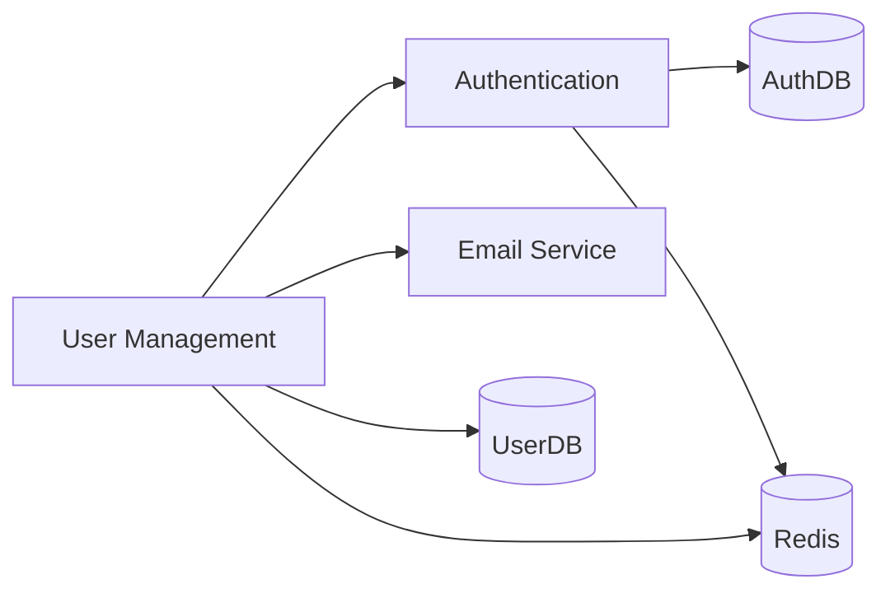

# Service Dependency Mapping Skill

## Overview

Generate comprehensive service dependency maps in structured formats (YAML/JSON) by analyzing codebases for service-to-service calls, database connections, external API integrations, and message queue usage.

## Core Techniques

### 1. Service Discovery

**Goal:** Identify all services in the codebase

**Techniques:**

**For .NET/C# (Web API, WCF):**
```csharp
// Grep patterns:
- "class.*Controller\s*:\s*.*Controller"  // API Controllers
- "\[Route\("                              // Route attributes
- "interface.*Service"                     // Service interfaces
- "public class.*Service"                  // Service implementations

// File patterns:
- **/*Controller.cs
- **/*Service.cs
- **/Controllers/*.cs
```

**For Node.js/Express:**
```javascript
// Grep patterns:
- "app\.(get|post|put|delete|patch)"      // Express routes
- "router\.(get|post|put|delete)"         // Express routers
- "exports.*=.*function"                   // Exported functions

// File patterns:
- **/routes/*.js
- **/controllers/*.js
- **/services/*.js
```

**For Java/Spring:**
```java
// Grep patterns:
- "@RestController"                        // Spring REST controllers
- "@Service"                               // Spring services
- "@RequestMapping"                        // Request mappings

// File patterns:
- **/src/**/controller/*.java
- **/src/**/service/*.java
```

### 2. Database Dependency Detection

**Goal:** Identify which services connect to which databases

**Connection String Patterns:**

```csharp
// .NET
- "ConnectionString"
- "Data Source=|Server="
- "Database=|Initial Catalog="
- "User ID=|uid="

// Node.js
- "mongoose.connect"
- "new Pool({" // PostgreSQL
- "createConnection({" // MySQL

// Java
- "@PersistenceContext"
- "DriverManager.getConnection"
- "spring.datasource.url"
```

**Configuration Files:**
```
appsettings.json
web.config
application.properties
application.yml
.env files
```

**Analysis Process:**
1. Find connection strings in configuration files
2. Identify database type from connection string patterns
3. Analyze code for CRUD operations (Read/Write/Delete)
4. Extract database name and sanitize credentials

For TypeScript implementation:
→ `@orchestr8://examples/skills/dependency-mapping-detection`

### 3. Service-to-Service Call Detection

**Goal:** Identify HTTP/gRPC calls between services

**HTTP Client Patterns:**

**.NET:**
```csharp
// Grep patterns:
- "HttpClient"
- "new HttpClient()"
- "httpClient.GetAsync|PostAsync|PutAsync|DeleteAsync"
- "RestClient"
- "WebClient"

// Look for base URLs in config or code:
- "BaseAddress = new Uri("
- "baseUrl ="
```

**Node.js:**
```javascript
// Grep patterns:
- "axios\.(get|post|put|delete)"
- "fetch\("
- "http.request|https.request"
- "request\({" // request library

// Configuration:
- process.env.API_BASE_URL
- config.apiUrl
```

**Java/Spring:**
```java
// Grep patterns:
- "@FeignClient"
- "RestTemplate"
- "WebClient"
- "@LoadBalanced"
```

**Analysis Process:**
1. Find all HttpClient/RestTemplate/axios usages
2. Extract URLs or configuration keys
3. Resolve configuration to actual service names
4. Map endpoints to target services

For TypeScript implementation with URL resolution:
→ `@orchestr8://examples/skills/dependency-mapping-detection`

### 4. Message Queue Dependency Detection

**Goal:** Identify pub/sub or queue-based communication

**Common Patterns:**

**RabbitMQ (.NET):**
```csharp
// Grep patterns:
- "ConnectionFactory"
- "IConnection.*CreateConnection"
- "IModel.*QueueDeclare"
- "basicPublish|BasicConsume"
```

**Azure Service Bus:**
```csharp
// Grep patterns:
- "ServiceBusClient"
- "ServiceBusSender"
- "ServiceBusReceiver"
- "SendMessageAsync"
- "ReceiveMessagesAsync"
```

**AWS SQS/SNS:**
```javascript
// Grep patterns:
- "AWS.SQS"
- "AWS.SNS"
- "sendMessage"
- "receiveMessage"
- "publish"
```

**Analysis Process:**
1. Find queue client initialization (RabbitMQ, Service Bus, SQS, Kafka)
2. Find publish operations in code
3. Find subscribe/consume operations
4. Extract queue names and message types

For TypeScript implementation with all queue types:
→ `@orchestr8://examples/skills/dependency-mapping-detection`

### 5. External API Integration Detection

**Goal:** Identify third-party API dependencies

**Common Patterns:**

**Detection Process:**
1. Grep for HTTP(S) calls to external domains
2. Extract and classify domains (internal vs external)
3. Match against known API patterns (Stripe, SendGrid, Twilio, etc.)
4. Infer purpose from domain and context

For TypeScript implementation with API catalog:
→ `@orchestr8://examples/skills/dependency-mapping-detection`

## YAML Output Format

### Complete Service Map

```yaml
metadata:
  generatedAt: "2025-11-11T14:30:00Z"
  analyzedPath: "/Users/architect/codeRepos/LegacyApp"
  serviceCount: 30
  
services:
  - id: user-management-service
    name: UserManagement
    path: src/API/Services/UserService
    type: REST API
    framework: ASP.NET Web API
    
    dependencies:
      internal:
        - service: authentication-service
          calls:
            - endpoint: /api/auth/validate
              method: POST
              purpose: Token validation
            - endpoint: /api/auth/refresh
              method: POST
              purpose: Token refresh
          location: UserService/Controllers/UserController.cs:45
          
        - service: email-service
          calls:
            - endpoint: /api/email/send
              method: POST
              purpose: Welcome email
          location: UserService/Services/NotificationService.cs:78
          
      external:
        - name: Stripe API
          domain: api.stripe.com
          purpose: Payment processing
          endpoints:
            - /v1/customers
            - /v1/subscriptions
          authentication: API Key
          location: UserService/Services/PaymentService.cs:123
          
      databases:
        - name: UserDB
          type: SQL Server
          connectionString: "Server=sql-prod;Database=UserDB;..."
          operations: [Read, Write, Delete]
          tables:
            - Users
            - UserRoles
            - UserPermissions
          location: appsettings.json:ConnectionStrings:UserDB
          
      messageQueues:
        - name: UserEventsQueue
          type: RabbitMQ
          operations: [Publish]
          messages:
            - UserCreatedEvent
            - UserUpdatedEvent
            - UserDeletedEvent
          location: UserService/Events/UserEventPublisher.cs:34
          
      caching:
        - name: RoleCache
          type: Redis
          operations: [Read, Write]
          ttl: 3600
          location: UserService/Services/RoleService.cs:89
          
  - id: authentication-service
    name: AuthenticationService
    # ... similar structure
    
dependencyGraph:
  # Adjacency list for visualization
  user-management-service:
    - authentication-service
    - email-service
    - UserDB
    - UserEventsQueue
    
  authentication-service:
    - AuthDB
    - Redis
    
circularDependencies:
  - services: [order-service, inventory-service, order-service]
    description: "Order service calls inventory, which calls order"
    severity: high
    recommendation: "Introduce event-driven pattern to break cycle"
```

## Dependency Visualization

### Mermaid Diagram Generation

```typescript
function generateMermaidDiagram(serviceMap: ServiceMap): string {
  return `
graph LR
    %% Services
    ${serviceMap.services.map(s => `${s.id}["${s.name}"]`).join('\n    ')}
    
    %% Databases
    ${getDatabases(serviceMap).map(db => `${db.id}[("${db.name}")]`).join('\n    ')}
    
    %% Dependencies
    ${generateDependencyLinks(serviceMap)}
    
    %% Styling
    classDef service fill:#4A90E2,stroke:#2E5C8A,color:#fff
    classDef database fill:#50C878,stroke:#2E7D4E,color:#fff
    classDef external fill:#F39C12,stroke:#C87F0A,color:#fff
    
    class ${serviceMap.services.map(s => s.id).join(',')} service
    class ${getDatabases(serviceMap).map(db => db.id).join(',')} database
`
}
```

**Example Output:**



## Impact Analysis

### Change Impact Calculator

**Analysis Process:**
1. Find all direct dependents of target service
2. Find transitive dependents (cascade effect)
3. Calculate impact level based on affected service count
4. Estimate downtime based on change type and scope
5. Calculate cascade depth for risk assessment

For complete TypeScript implementation with impact calculation:
→ `@orchestr8://examples/skills/dependency-mapping-analysis`

**Example Impact Report:**

```yaml
impactAnalysis:
  targetService: authentication-service
  changeType: breaking-change
  
  directDependents:
    - user-management-service
    - order-service
    - payment-service
    
  transitiveDependents:
    - reporting-service  # depends on order-service
    - invoice-service    # depends on payment-service
    
  impactLevel: critical
  cascadeDepth: 2
  affectedServiceCount: 5
  estimatedDowntime: 2-4 hours
  
  recommendations:
    - Deploy during maintenance window
    - Coordinate with teams owning dependent services
    - Implement backward compatibility if possible
    - Consider API versioning strategy
```

## Circular Dependency Detection

**Algorithm**: Depth-first search with cycle detection

**Process:**
1. Traverse dependency graph using DFS
2. Maintain visited set and recursion stack
3. Detect cycles when encountering node in current stack
4. Calculate severity based on cycle length
5. Generate recommendations to break cycles

For complete DFS implementation with severity calculation:
→ `@orchestr8://examples/skills/dependency-mapping-analysis`

## Best Practices

### Analysis Best Practices

✅ **Multi-source analysis** - Check code, config, and documentation
✅ **Sanitize secrets** - Never include passwords in output
✅ **Resolve indirection** - Follow configuration variables to actual values
✅ **Categorize dependencies** - Internal vs external, sync vs async
✅ **Include context** - File paths and line numbers for verification
✅ **Detect patterns** - Use framework-specific patterns for accuracy
✅ **Validate findings** - Cross-reference with multiple sources

### Output Best Practices

✅ **Structured format** - YAML/JSON for automation
✅ **Human-readable** - Also generate markdown diagrams
✅ **Complete metadata** - Include generation timestamp, paths
✅ **Actionable insights** - Flag circular dependencies, bottlenecks
✅ **Visualizations** - Generate Mermaid diagrams for stakeholders

## Integration with Workflows

### Legacy System Analysis Workflow

```markdown
**Phase 2: Dependency Mapping (20-40%)**

→ Load Service Dependency Mapping Skill:
`@orchestr8://skills/service-dependency-mapping`

Activities:
- Discover all services in codebase
- Map service-to-service dependencies
- Identify database dependencies
- Detect message queue usage
- Find external API integrations
- Generate dependency YAML
- Create visualization diagrams
- Detect circular dependencies

Outputs:
- dependencies/service-map.yaml
- dependencies/dependency-graph.md (Mermaid)
- dependencies/circular-dependencies.yaml
```

## Success Criteria

✅ All services discovered and cataloged
✅ Internal dependencies mapped with endpoints
✅ Database connections identified per service
✅ Message queue dependencies documented
✅ External API integrations cataloged
✅ YAML output validates against schema
✅ Dependency visualization generated
✅ Circular dependencies detected and flagged
✅ Impact analysis capabilities functional
